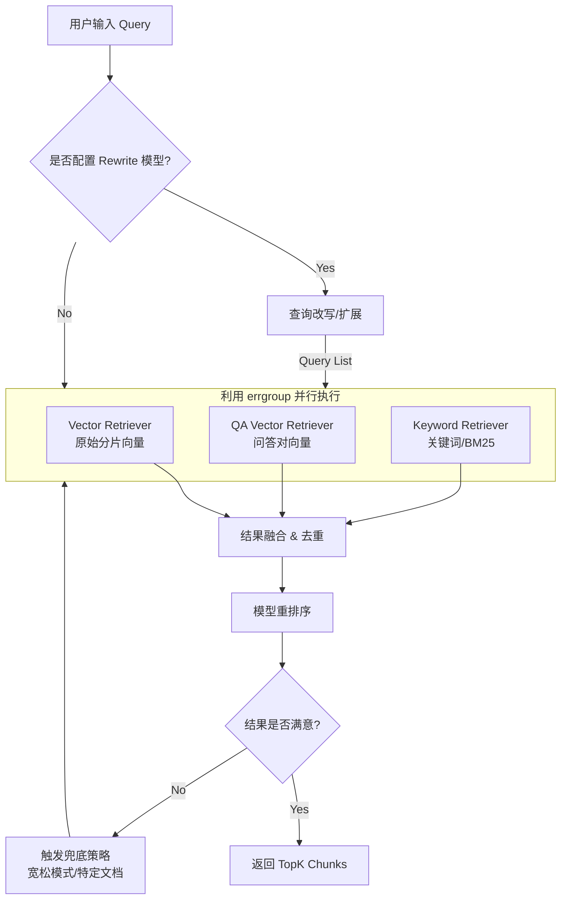

# RAG 召回系统设计文档

## 1. 设计目标
参考 [RAGFlow](https://github.com/infiniflow/ragflow) 的先进架构，构建一个**高并发、低耦合、可扩展**的混合召回系统。

### 核心特性
- **混合检索 (Hybrid Search)**: 结合 向量检索 (Dense) + 关键词检索 (Sparse/BM25) + QA向量检索，提升召回准确率。
- **高并发 (High Concurrency)**: 利用 Go 的 `goroutine` 和 `errgroup` 实现多路并行检索，降低长尾延迟。
- **低耦合 (Low Coupling)**: 基于接口 (`Interface`) 编程，通过 `Strategy Pattern` (策略模式) 组装不同的检索器，便于后续接入 ES/Solr 或其他向量库。
- **智能兜底 (Smart Fallback)**: 实现“主检索 -> 特定文档检索 -> 宽松检索”的三级回退机制，最大程度避免 Zero retrieval。
- **动态流程 (Dynamic Flow)**: 根据知识库配置动态决定是否执行“查询改写”等步骤。

---

## 2. 总体架构

采用 **Eino Graph** 进行流程编排，DAG (有向无环图) 结构如下：



---

## 3. 详细模块设计

### 3.1 检索器接口设计 (Retriever Interface)
为了实现低耦合，我们定义统一的检索接口。所有的检索方式（向量、关键词、全文）都实现该接口。

```go
// core/retriever/types.go

type RetrievalRequest struct {
    Query             string
    KnowledgeBaseID   uint64
    TopK              int
    ScoreThreshold    float64
    DocIDs            []string // 选填，限定文档范围
    Filters           map[string]interface{}

    // [New] 检索控制参数
    Mode              string  // vector, fulltext, hybrid
    HybridWeights     map[string]float64 // vector: 0.7, keyword: 0.3
    UseRerank         bool
    RerankModelID     uint64
}

type RetrievalResult struct {
    ChunkID  string
    Content  string
    Score    float64
    MetaData map[string]interface{}
    Source   string // "vector", "keyword", "qa"
}

// Retriever 定义单个检索器的行为
type Retriever interface {
    Retrieve(ctx context.Context, req *RetrievalRequest) ([]*RetrievalResult, error)
}
```

### 3.2 多路并行检索 (Parallel Retrieval Strategy)
利用 Go 的并发特性，我们不再串行执行检索，而是同时发起。

- **Vector Search**: 使用 `milvus-sdk-go` 进行 Embedding 相似度检索 (主要召回手段, 权重 0.7~0.9)。
- **Keyword Search**: 如果 Milvus 支持 Sparse Vector (2.4+)，或者使用单独的 ES/Bleve。如果是简单实现，可对 Chunk 内容做 SQL `LIKE` 或 `FullText` 索引 (权重 0.1~0.3)。
- **QA Search**: 针对 `qa_pairs` 生成的向量进行检索，这对于“问题匹配”非常有效。

**并发实现伪代码**:
```go
g, ctx := errgroup.WithContext(ctx)
results := make([][]*RetrievalResult, 3)

// 1. 向量检索
g.Go(func() error {
    res, err := vectorRetriever.Retrieve(ctx, req)
    results[0] = res
    return err
})

// 2. 关键词检索
g.Go(func() error {
    res, err := keywordRetriever.Retrieve(ctx, req)
    results[1] = res
    return err
})

// 3. QA 检索
g.Go(func() error {
    // ...
})

if err := g.Wait(); err != nil {
    return nil, err
}
```

### 3.3 检索模式与策略配置 (Retrieval Modes) [Updated]
系统支持三种检索模式，用户可按需配置：

#### 3.3.1 纯向量检索 (Vector Search Only)
- **描述**: 仅使用 Embedding 语义检索。
- **配置项**:
    - `top_k`: 返回数量 (1-10)。
    - `score_threshold`: 相似度阈值 (0-1)。
    - `rerank_logic`: 可选是否开启重排序模型。

#### 3.3.2 全文检索 (Full-Text Search Only)
- **描述**: 传统的关键词匹配检索 (如 ES/Bleve)。
- **配置项**:
    - `top_k`: 返回数量。

#### 3.3.3 混合检索 (Hybrid Search - Default)
结合向量与关键词，支持两种融合策略（二选一）：
1.  **加权排序 (Weighted Sort)**:
    -   不需要 Rerank 模型，速度快。
    -   **配置**: 调整向量与关键词权重的比例 (默认 Vector=0.7, Keyword=0.3)。
    -   `Score = (vec_score * 0.7) + (kw_score * 0.3)`
2.  **重排序 (Rerank Sort)**:
    -   使用 Rerank 模型对初步召回结果进行精排，效果最好但耗时增加。
    -   **配置**: 指定 Rerank 模型ID、TopK、Score 阈值。

### 3.4 结果融合与重排序 (Fusion & Rerank)

#### 3.3.1 归一化与加权融合 (Web Search Concept: RAGFlow Weighted Fusion)
不同检索器的分数分布不同（例如，向量距离是 0~1，BM25 可能是 0~10+）。
我们需要先 **Min-Max Normalization**，然后进行加权求和。

`FinalScore = (w_vec * Norm(VecScore)) + (w_key * Norm(KeyScore))`

#### 3.3.2 倒数排名融合 (RRF - Reciprocal Rank Fusion)
如果不想处理复杂的分数归一化，可以使用 RRF，只关注排名。
`RRF_Score = 1 / (k + Rank_i)`
RAGFlow 强烈推荐这种方式来实现 Hybrid Search 的稳定性。

#### 3.3.3 模型重排序 (Model Rerank)
融合后的 `Top N` (例如 50 个) 结果，送入 `Rerank Model` (如 BGE-Reranker, Cohere) 进行精排，输出最终的 `Top K` (例如 10 个)。
这一步是同步的且计算量大，**必须加缓存**。

---

## 4. 兜底策略 (Fallback Mechanism)

为了解决“搜不到”的问题，实现三层回退逻辑：

1.  **Strict Mode (第一层)**:
    -   默认配置：`Similarity > 0.7` AND `Match > 50%`.
    -   如果结果数量 < TopK，进入下一层。

2.  **Document Specific (第二层)**:
    -   场景：用户在 Query 中指明了 @文档 或系统识别出用户意图是针对某文档。
    -   逻辑：忽略阈值限制，直接在指定 `doc_ids` 中按相关性排序召回。

3.  **Fuzzy Mode (第三层 - 宽松搜索)**:
    -   场景：前两层结果极少，且用户配置了 `Run In Fuzzy Mode`。
    -   逻辑：
        -   降低向量阈值 (e.g., 0.7 -> 0.35)。
        -   降低关键词匹配度 (e.g., AND -> OR)。
        -   **目标**: 宁可返回相关性低的内容，也不返回空。

---

## 5. 性能与可维护性设计

### 5.1 缓存设计 (Redis Layer)
召回是高频读取操作，必须由 Redis 承载热点流量。
- **Key 设计**: `rag:retrieval:{kb_id}:{md5(query)}:{params_hash}`
- **TTL**: 1小时 - 24小时 (取决于知识库更新频率)。
- **更新策略**: 知识库新增 Chunk 时，只失效相关 Key 或等待自然过期 (Soft Consistency)。

### 5.2 数据库与连接池
- **MySQL**: 只存储元数据，不进行全文检索 (除非数据量极小)。
- **Milvus**: 核心向量引擎，需配置合理的 `index_type` (IVF_FLAT / HNSW) 以平衡速度和精度。使用全局单例 Client。

### 5.3 可观测性
- **Trace**: 为每个检索请求生成 `TraceID`，贯穿 Rewrite -> Retrieve -> Rerank 全流程。
- **Metrics**: 监控各路召回的耗时 (P99)、命中率、Zero retrieval 比例。

---

## 6. 接口请求定义 (Draft)


```json
POST /v1/retrieval/{knowledge_base_id}
{
    "query": "RAG 阈值配置",
    "retrieval_mode": "hybrid", // vector, fulltext, hybrid
    "retrieval_config": {
        // 全文检索只利用topk
        "top_k": 10,
        "score_threshold": 0.6,
        // 混合检索策略配置
        "hybrid_strategy": {
            "type": "weighted", // weighted 或 rerank
            "weights": {
                 "vector": 0.7,
                 "keyword": 0.3
            },
            "rerank_model_id": 0 // 如果 type=rerank 则必填
        }
    },
    "doc_ids": ["doc_123"] // 可选
}
```

后端返回 (Response):

```json
{
    "code": 200,
    "msg": "success",
    "data": {
        "knowledge_base_id": 1001,
        "doc_ids": ["123", "124"],
        "time_cost_ms": 45,
        "chunks": [
            {
                "chunk_id": "c_1001_123_0",
                "doc_id": "123",
                "doc_name": "RAG系统设计.pdf",
                "content": "...相关文本片段...",
                "score": 0.85,
                "source": "vector" // vector, keyword, or hybrid
            },
            {
                "chunk_id": "c_1001_124_5",
                "doc_id": "124",
                "doc_name": "配置指南.md",
                "content": "...阈值配置说明...",
                "score": 0.72,
                "source": "keyword"
            }
        ]
    }
}
```

---

## 7. 持久化与分析 (Persistence & Analytics)

为了后续优化检索效果（Bad Case 分析）及运营统计，**必须**保存召回记录。

### 7.1 表结构设计 `knowledge_retrieval_log`

```sql
CREATE TABLE `knowledge_retrieval_log` (
  `id` bigint(20) unsigned NOT NULL AUTO_INCREMENT,
  `knowledge_base_id` bigint(20) unsigned NOT NULL COMMENT '知识库ID',
  `query` varchar(2048) NOT NULL DEFAULT '' COMMENT '用户原始查询',
  `retrieval_params` json DEFAULT NULL COMMENT '检索参数快照(阈值/权重等)',
  `chunk_count` int(11) NOT NULL DEFAULT '0' COMMENT '召回chunk数',
  `time_cost_ms` int(11) NOT NULL DEFAULT '0' COMMENT '查询耗时(ms)',
  `created_at` datetime NOT NULL DEFAULT CURRENT_TIMESTAMP,
  `updated_at` datetime NOT NULL DEFAULT CURRENT_TIMESTAMP ON UPDATE CURRENT_TIMESTAMP,
  PRIMARY KEY (`id`),
  KEY `idx_kb_created` (`knowledge_base_id`, `created_at`)
) ENGINE=InnoDB DEFAULT CHARSET=utf8mb4 COMMENT='召回日志表';
```


# 其他接口说明:
1. 获取用户所有模型:
```go
    @doc "获取指定类型的模型"
    @handler getUserApiByModelType
    get /user/api/:user_id/:model_type (GetUserModelReq) returns (GetUserModelResp);

    // 获取用户所有指定的模型
    GetUserModelReq {
        UserId int64 `path:"user_id"`
        // 仅支持 embedding、chat、qa、rewrite、rerank
        ModelType string `path:"model_type"`
    }

    GetUserModelResp {
        Total int64 `json:"total"`
        List []UserApiInfo `json:"list"`
    }

// 用户API配置信息
UserApiInfo {
Id          int64   `json:"id"`
UserId      int64   `json:"user_id"`
ConfigName  string  `json:"config_name"`
ApiKey      string  `json:"api_key"`
BaseUrl     string  `json:"base_url"`
ModelName   string  `json:"model_name"`
ModelType   string  `json:"model_type"`
ModelDim    int     `json:"model_dim"`
MaxTokens   int     `json:"max_tokens"`
Temperature float64 `json:"temperature"`
TopP        float64 `json:"top_p"`
Timeout     int     `json:"timeout"`
Status      int     `json:"status"`
IsDefault   int     `json:"is_default"`
CreatedAt   string  `json:"created_at"`
UpdatedAt   string  `json:"updated_at"`
}
```


api 的logic代码已经生成，不需要再次调用goctl命令。如果必须要调用，请使用`make gen-api`命令即可
注意：
- retrieve内部用到的embedding、rerank等模型都是动态变化的，不是固定写死的，所以不要在graph编排阶段就将相关模型配置传入。