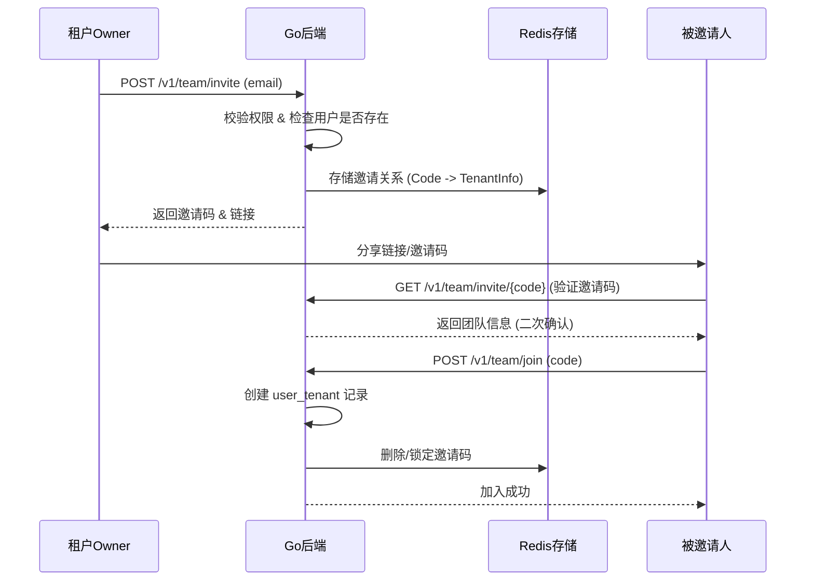

# 团队空间设计文档

## 1. 功能概览
团队空间是基于多租户架构实现的用户协作模块。每个租户（Tenant）代表一个独立的工作空间，用户可以作为不同的角色（Owner, Admin, Member）加入一个或多个租户。

核心功能：
- **团队成员管理**：查看当前工作空间的成员列表，由 Owner 进行管理。
- **加入的团队**：查看自己加入的其他团队空间。
- **邀请机制**：通过邮箱发起邀请，生成唯一邀请码/链接。
- **加入模式**：支持输入邀请码或通过邀请链接直接触发加入流程。

## 2. 界面路由与布局
- **访问路由**: `/settings/team`
- **布局设计**:
  - **左侧边栏**: 在 `用户信息`、`模型配置` 下方新增 `团队` 导航项。
  - **主内容区 (从上到下)**:
    1. **当前工作空间标题**: 展示 `xxx 的工作空间` (对应 `tenant.name`)。
    2. **团队成员列表**: 表格展示（姓名、加入日期、邮箱、状态、操作）。
    3. **加入的团队列表**: 表格展示（团队名称、加入日期、所有者、角色、操作）。
    4. **操作按钮**: 右上角提供 `【邀请成员】` (仅 Owner/Admin 可见) 和 `【加入团队】` 按钮。

### 界面参考图


## 3. 核心业务流程

### 3.1 成员邀请流程 (Invite Flow)


## 4. 接口规范 (API Specification)

### 4.1 团队管理 (`team.api`)
文件位置: `restful/rag/api/team.api`

```go
type (
    // 团队成员信息
    TeamMember {
        UserId     string `json:"user_id"`
        Nickname   string `json:"nickname"`
        Email      string `json:"email"`
        Role       string `json:"role"`        // owner | admin | member
        Status     int64  `json:"status"`      // 1-有效, 0-禁用
        JoinedTime int64  `json:"joined_time"`
    }

    // 我加入的团队信息
    JoinedTeam {
        TenantId   string `json:"tenant_id"`
        TenantName string `json:"tenant_name"`
        OwnerName  string `json:"owner_name"`
        Role       string `json:"role"`
        JoinedTime int64  `json:"joined_time"`
    }

    // 邀请码验证响应
    InviteVerifyResp {
        TenantId   string `json:"tenant_id"`
        TenantName string `json:"tenant_name"`
        Inviter    string `json:"inviter"`
    }

    // 邀请请求
    InviteReq {
        Email string `json:"email"`
    }

    // 加入团队请求
    JoinReq {
        InviteCode string `json:"invite_code"`
    }
)

@server (
    jwt: Auth
    group: team
    prefix: /v1
)
service rag {
    @doc "获取当前团队成员列表"
    @handler listMembers
    get /team/members returns ([]TeamMember)

    @doc "获取我加入的团队列表"
    @handler listJoinedTeams
    get /team/joined returns ([]JoinedTeam)

    @doc "发起邀请"
    @handler createInvite
    post /team/invite (InviteReq) returns (string) // 返回邀请码

    @doc "验证邀请码信息"
    @handler verifyInvite
    get /team/invite/:code returns (InviteVerifyResp)

    @doc "使用邀请码加入团队"
    @handler joinTeam
    post /team/join (JoinReq) returns (bool)
}
```

## 5. 存储设计

### 5.1 数据库 (MySQL)
复用 `user_tenant` 表：
- `tenant_id`: 目标团队 ID。
- `user_id`: 加入者 ID。
- `role`: 初始默认为 `member`。
- `invited_by`: 邀请发起者 ID。

### 5.2 缓存 (Redis)
用于存储临时邀请状态，设置过期时间（建议 24-72 小时）。

**键名设计**: `rag:invite:code:{code}`
**存储结构**:
```json
{
  "tenant_id": "99bb-...",
  "inviter_id": "u-123",
  "role": "member",
  "type": "one_time" 
}
```

## 6. 权限与安全

### 6.1 权限控制 (RBAC)
| 操作         |    Owner     |     Admin      | Member |
| :----------- | :----------: | :------------: | :----: |
| 发起邀请     |      √       |       √        |   ×    |
| 移除成员     |      √       | √ (仅限Member) |   ×    |
| 退出团队     | √ (需先转让) |       √        |   √    |
| 修改租户信息 |      √       |       √        |   ×    |

### 6.2 安全校验
- **邮箱存在性**: 仅允许邀请已在系统中注册的邮箱（简化 MVP 逻辑）。
- **重复加入**: 如果用户已在 `user_tenant` 且 `status=1`，拦截请求。
- **非法邀请码**: 邀请码不存在或过期，返回特定错误码 `100404`。

## 7. 前端实现重点
- **状态管理**: 在 `useAuthStore` 中维护 `tenants` 列表，切换租户后刷新页面或 Context。
- **弹窗交互**: 
  - 邀请弹窗：支持一键复制邀请链接。
  - 二次确认弹窗：在 `verifyInvite` 接口成功后，展示团队名称及所有者，增强用户信任。
