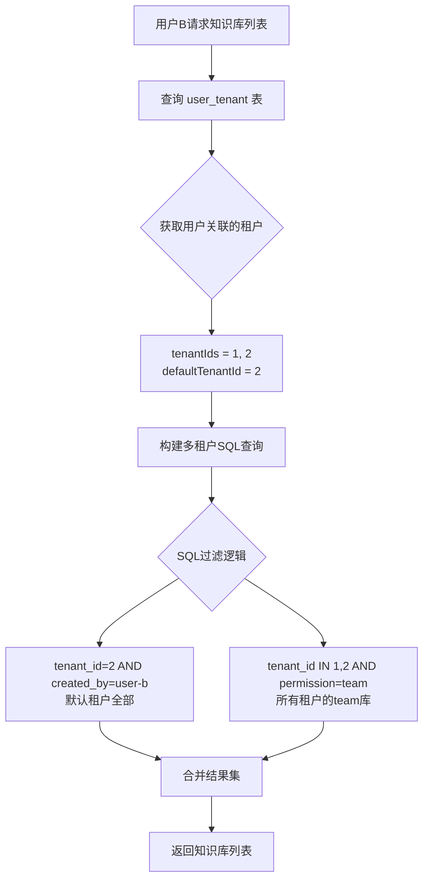

# 知识库多租户可见性优化（完整版）

## 问题描述

### 错误的理解 ❌
~~每个用户只属于一个租户，列表查询只需要基于当前用户的 `tenant_id` 过滤。~~

### 正确的多租户模型 ✅

#### 用户与租户的关系
- **用户A**: 注册时创建默认租户 `tenant_id=1`
- **用户B**: 注册时创建默认租户 `tenant_id=2`  
- **加入团队**: 用户A邀请用户B加入租户1
  - 此时用户B关联：`tenant_ids = [1, 2]`（默认租户2 + 加入的租户1）

#### 知识库可见性规则

**用户B应该看到**：
1. **默认租户**（`tenant_id=2`）的所有知识库  
   - `permission='me'` ✅（自己创建的私有库）
   - `permission='team'` ✅（自己租户的团队库）

2. **加入的租户**（`tenant_id=1`）的团队知识库
   - `permission='team'` ✅（团队库对所有成员开放）
   - `permission='me'` ❌（他人的私有库不可见）

3. **状态过滤**
   - 仅显示 `status=1`（启用）的知识库

---

## 核心实现逻辑

### SQL 查询策略（关键！）

```sql
SELECT * FROM knowledge_base
WHERE status = 1
  AND (
    -- 情况1: 用户默认租户的所有知识库（me + team）
    (tenant_id = '2' AND created_by = 'user-b-id')
    OR
    -- 情况2: 加入的租户中 team 权限的知识库
    (tenant_id IN ('1', '2') AND permission = 'team')
  )
ORDER BY created_time DESC
LIMIT 0, 20
```

**逻辑说明**：
- `(tenant_id = defaultTenantId AND created_by = userId)`: 自己默认租户的所有库（包含me权限）
- `(tenant_id IN (tenantIds) AND permission = 'team')`: 所有关联租户的team库

### 查询流程



---

## 后端实现方案

### 1. Model 层扩展

#### user_tenant_model.go
**新增方法**: 查询用户关联的所有租户

```go
type UserTenantModel interface {
    userTenantModel
    FindTenantsByUserId(ctx context.Context, userId string) (tenantIds []string, defaultTenantId string, err error)
}

func (m *customUserTenantModel) FindTenantsByUserId(ctx context.Context, userId string) ([]string, string, error) {
    query := fmt.Sprintf("SELECT tenant_id, is_default FROM %s WHERE user_id = ?", m.table)
    
    var results []struct {
        TenantId  string `db:"tenant_id"`
        IsDefault int64  `db:"is_default"`
    }
    
    err := m.QueryRowsNoCacheCtx(ctx, &results, query, userId)
    if err != nil {
        return nil, "", err
    }
    
    var tenantIds []string
    var defaultTenantId string
    
    for _, r := range results {
        tenantIds = append(tenantIds, r.TenantId)
        if r.IsDefault == 1 {
            defaultTenantId = r.TenantId
        }
    }
    
    return tenantIds, defaultTenantId, nil
}
```

#### knowledge_base_model.go
**新增方法**: 多租户列表查询

```go
type KnowledgeBaseModel interface {
    knowledgeBaseModel
    FindListByMultiTenants(ctx, userId, defaultTenantId string, tenantIds []string, page, pageSize int) ([]*KnowledgeBase, error)
    CountByMultiTenants(ctx, userId, defaultTenantId string, tenantIds []string) (int64, error)
}

func (m *customKnowledgeBaseModel) FindListByMultiTenants(...) ([]*KnowledgeBase, error) {
    // 构建 IN 子句占位符
    placeholders := strings.Join(strings.Split(strings.Repeat("?", len(tenantIds)), ""), ",")
    
    query := fmt.Sprintf(`
        SELECT %s FROM %s
        WHERE status = 1
          AND (
            (tenant_id = ? AND created_by = ?)
            OR
            (tenant_id IN (%s) AND permission = 'team')
          )
        ORDER BY created_time DESC
        LIMIT ?, ?
    `, knowledgeBaseRows, m.table, placeholders)
    
    // 参数顺序: defaultTenantId, userId, ...tenantIds, offset, pageSize
    args := []interface{}{defaultTenantId, userId}
    for _, tid := range tenantIds {
        args = append(args, tid)
    }
    args = append(args, (page-1)*pageSize, pageSize)
    
    var list []*KnowledgeBase
    err := m.QueryRowsNoCacheCtx(ctx, &list, query, args...)
    return list, err
}
```

### 2. Logic 层重构

#### list_knowledge_base_logic.go

```go
func (l *ListKnowledgeBaseLogic) ListKnowledgeBase(req *types.ListKnowledgeBaseReq) (resp *types.ListKnowledgeBaseResp, err error) {
    userId, err := common.GetUidFromCtx(l.ctx)
    if err != nil {
        return nil, err
    }

    // 1. 查询用户关联的所有租户（包括默认租户）
    tenantIds, defaultTenantId, err := l.svcCtx.UserTenantModel.FindTenantsByUserId(l.ctx, userId)
    if err != nil {
        logx.Errorf("查询用户租户失败: %v", err)
        return nil, xerr.NewInternalErrMsg("查询租户失败")
    }
    
    if len(tenantIds) == 0 {
        return &types.ListKnowledgeBaseResp{Total: 0, List: []types.KnowledgeBaseInfo{}}, nil
    }

    // 2. 多租户查询（SQL中完成所有过滤逻辑）
    list, err := l.svcCtx.KnowledgeBaseModel.FindListByMultiTenants(
        l.ctx, userId, defaultTenantId, tenantIds,
        int(req.Page), int(req.PageSize),
    )
    if err != nil {
        logx.Errorf("查询知识库列表失败: %v", err)
        return nil, err
    }

    // 3. 统计总数
    total, err := l.svcCtx.KnowledgeBaseModel.CountByMultiTenants(l.ctx, userId, defaultTenantId, tenantIds)
    if err != nil {
        logx.Errorf("统计失败: %v", err)
        return nil, err
    }

    // 4. 转换响应（无需应用层过滤，SQL已完成）
    respList := make([]types.KnowledgeBaseInfo, 0, len(list))
    for _, kb := range list {
        respList = append(respList, types.KnowledgeBaseInfo{
            Id:         kb.Id,
            TenantId:   kb.TenantId,
            Name:       kb.Name,
            Permission: kb.Permission,
            // ... 其他字段
        })
    }

    return &types.ListKnowledgeBaseResp{
        Total: total,
        List:  respList,
    }, nil
}
```

---

## 数据库优化

### 索引设计

```sql
-- knowledge_base 表
ALTER TABLE `knowledge_base` 
ADD INDEX `idx_tenant_permission_status` (`tenant_id`, `permission`, `status`),
ADD INDEX `idx_created_by` (`created_by`);

-- user_tenant 表
ALTER TABLE `user_tenant`
ADD INDEX `idx_user_id` (`user_id`);
```

### 执行计划验证

```sql
EXPLAIN SELECT * FROM knowledge_base
WHERE status = 1
  AND (
    (tenant_id = '2' AND created_by = 'user-b')
    OR
    (tenant_id IN ('1', '2') AND permission = 'team')
  )
ORDER BY created_time DESC
LIMIT 0, 20;

-- 预期: 使用 idx_tenant_permission_status 索引
```

---

## 测试场景

### 场景1: 单租户用户
**用户A**: 未加入其他租户
- 关联租户: `[1]`（默认租户）
- 可见知识库: 租户1的所有库（`me` + `team`）

### 场景2: 双租户用户
**用户B**: 默认租户2，加入租户1
- 关联租户: `[1, 2]`
- 默认租户: `2`
- 可见知识库:
  - 租户2的所有库（`me` + `team`）
  - 租户1的 `team` 库

### 场景3: 多租户复杂场景
**用户C**: 加入3个租户
- 关联租户: `[1, 2, 3]`
- 默认租户: `3`
- 可见知识库:
  - 租户3的所有库
  - 租户1、2的 `team` 库

---

## API 示例

### 请求
```http
GET /v1/knowledge/list?page=1&page_size=20
Authorization: Bearer <token>
```

### 响应
```json
{
  "code": 200,
  "data": {
    "total": 15,
    "list": [
      {
        "id": "kb-001",
        "tenant_id": "1",
        "name": "团队文档",
        "permission": "team",
        "created_by": "user-a"
      },
      {
        "id": "kb-002",
        "tenant_id": "2",
        "name": "我的笔记",
        "permission": "me",
        "created_by": "user-b"
      }
    ]
  }
}
```

---

## 实施检查清单

### 后端开发
- [ ] `UserTenantModel.FindTenantsByUserId()` 实现
- [ ] `KnowledgeBaseModel.FindListByMultiTenants()` 实现
- [ ] `KnowledgeBaseModel.CountByMultiTenants()` 实现
- [ ] `ListKnowledgeBase` Logic 重构
- [ ] 移除旧的应用层权限过滤代码

### 数据库
- [ ] 添加复合索引
- [ ] 验证 user_tenant 的 is_default 唯一性
- [ ] 执行计划性能测试

### 测试
- [ ] 单租户场景测试
- [ ] 多租户可见性测试
- [ ] 权限混合场景测试
- [ ] 性能压测（1000+ 知识库）

---

## 关键差异对比

| 维度         | 旧实现（错误）     | 新实现（正确）            |
| :----------- | :----------------- | :------------------------ |
| 查询范围     | 单一 tenant_id     | 用户关联的所有 tenant_ids |
| 权限过滤     | 应用层 for 循环    | SQL WHERE 条件            |
| 默认租户处理 | 未区分             | 可见所有类型（me+team）   |
| 加入的租户   | 不支持             | 仅可见 team 库            |
| 性能         | 查询后过滤（低效） | SQL 直接过滤（高效）      |

---

## 注意事项

> [!IMPORTANT]
> 这是一个**架构级重构**，会影响核心业务逻辑。

1. **向后兼容**: 单租户用户不受影响（tenantIds只包含默认rental）
2. **SQL注入防护**: 使用参数化查询，IN 子句动态生成占位符
3. **索引依赖**: 必须先添加索引再上线
4. **数据一致性**: user_tenant 必须有正确的 is_default 标记
5. **性能监控**: 上线后关注慢查询日志