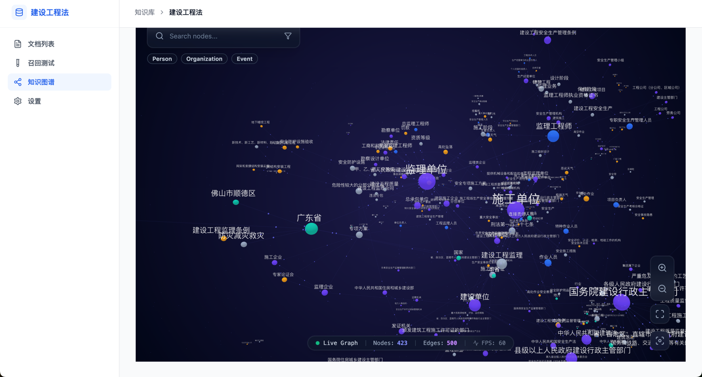
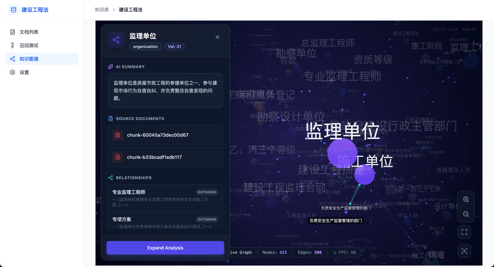
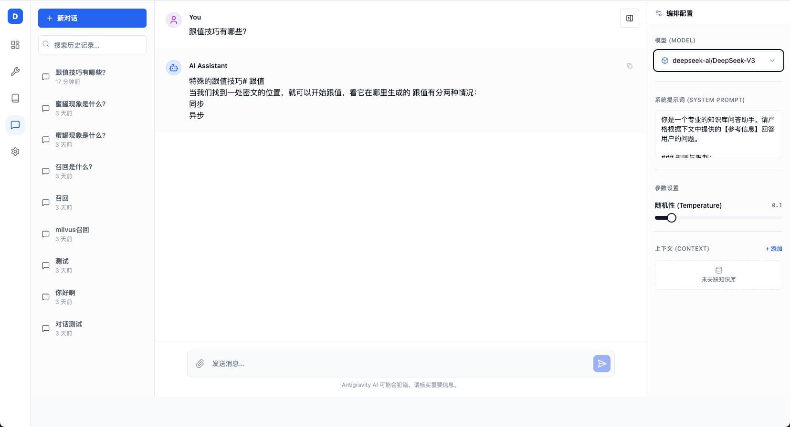
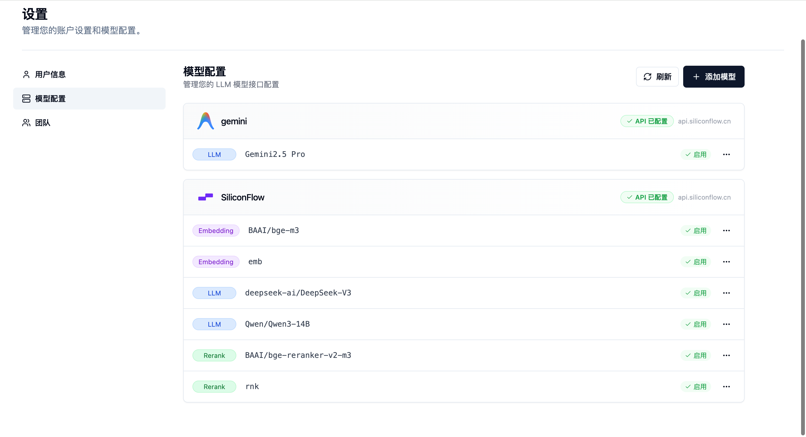
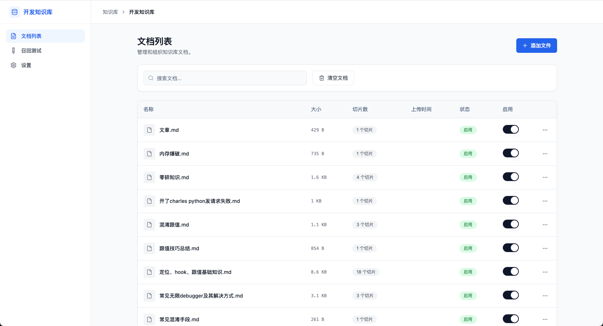
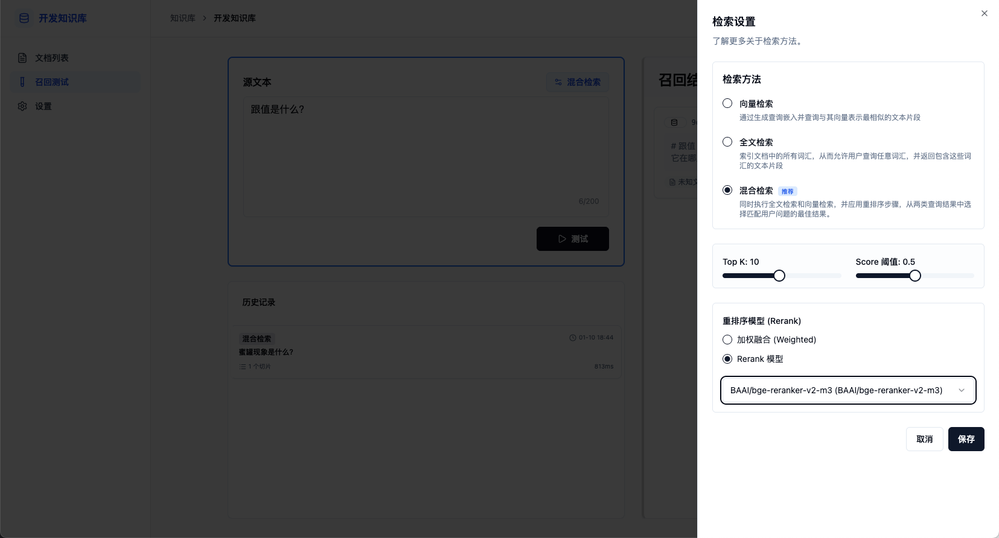
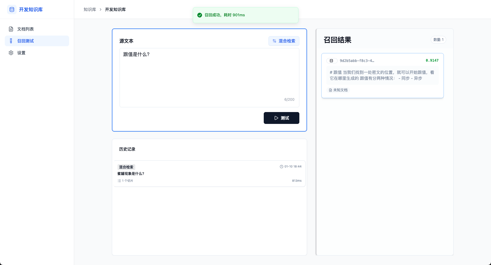

# Go-Zero RAG 知识库系统

基于 Go-Zero 和 React 构建的企业级高性能 RAG（检索增强生成）知识库系统。

## 📖 项目介绍

本项目旨在帮助企业与个人快速搭建私有化知识库，通过向量检索与 LLM（大语言模型）的深度结合 (RAG)，有效解决大模型在垂直领域知识缺失、即时性不足与幻觉问题。
最新版本支持 **GraphRAG (知识图谱增强检索)**，通过提取实体与关系，构建更深层次的语义理解能力。

核心定位为：**高性能、易扩展、开箱即用的 RAG 解决方案**。

### 核心特性

- **多格式解析**: 支持 PDF, TXT, Word, Markdown 等主流文档格式的上传与解析、切片。
- **知识图谱 (GraphRAG)**: 
    - **自动提取**: 基于 LLM 的 Loop-Gleaning 策略，自动提取文档中的实体（组织、人物、地理、事件、类别）及其关系。
    - **统一存储**: 所有数据（文档分片向量、知识图谱实体与关系）统一存储于 **Elasticsearch**，简化架构并提升运维效率。
    - **可视/配置**: 在前端可配置是否启用图谱功能及实体类型。
- **灵活编排**: 基于字节跳动 **Eino** 框架，支持复杂的 RAG 检索流程与图提取工作流编排。
- **高性能检索**: 基于 Elasticsearch 的向量检索能力 (KNN)，支持海量数据毫秒级检索。
- **混合检索**: 充分利用 ES 的能力，支持关键词检索 (BM25) 与向量检索的混合召回 (Hybrid Search) 及重排序 (Rerank)。
- **现代化交互**: 采用 React + Shadcn/ui 打造极简、流畅的类 Dify 用户体验。

## 🛠 技术栈

### 后端 (Backend)
- **核心框架**: [Go-Zero](https://go-zero.dev/) (Web/RPC, Middleware)
- **大模型编排**: ByteDance Eino (Graph/Chain, Node, Edge)
- **数据库**: 
    - MySQL 8.0+ (业务元数据)
    - Redis (缓存与会话)
    - [Elasticsearch](https://www.elastic.co/) (核心检索引擎：负责向量存储、倒排索引及知识图谱存储)
- **对象存储**: MinIO
- **消息队列**: Kafka (异步任务解耦：文档解析、图谱生成)

### 前端 (Frontend)
- **框架**: React 18 (Vite)
- **UI 组件库**: Shadcn/ui + Tailwind CSS
- **状态管理**: Zustand
- **语言**: TypeScript

## 📂 项目结构

```text
├── restful/          # HTTP API 服务 (Go-Zero Gateway)
│   └── rag/          # 主业务服务
├── consumer/         # 异步消息消费者 (Workers)
│   ├── document_index/ # 文档切片与向量化消费者
│   └── graph_extract/  # 知识图谱提取消费者
├── internal/         # 核心业务逻辑与共享代码
│   ├── model/        # 数据库模型 (MySQL, ES)
│   ├── mq/           # 消息队列定义
│   └── graphrag/     # GraphRAG 核心算法实现
├── script/           # 数据库初始化脚本 (MySQL, ES, Docker)
└── fe/               # 前端项目 (React)
```

## 🚀 快速开始

### 1. 环境要求
- **Go**: 1.21+
- **Node.js**: 18+
- **Docker & Docker Compose**
- **Goctl**: `go install github.com/zeromicro/go-zero/tools/goctl@latest`

### 2. 基础设施搭建
使用 Docker Compose 启动所有依赖服务（MySQL, Redis, MinIO, Kafka, Elasticsearch）：

```bash
docker-compose up -d
```

请确保所有容器状态健康 (Healthy) 后再继续。

### 3. 后端启动 (多服务)

本项目采用微服务/分布式架构，需分别启动 API 服务和各类消费者。

#### 3.1 启动 API 服务
```bash
# 1. 安装依赖
go mod tidy

# 2. 运行 RESTful API
cd restful/rag
go run rag.go
# 服务默认运行在 8888 端口
```

#### 3.2 启动消费者 (Workers)
建议新开终端窗口启动异步任务消费者：

```bash
# 1. 启动文档索引消费者 (处理文档解析、向量化)
cd consumer/document_index
go run main.go

# 2. 启动图谱提取消费者 (可选, 需开启 GraphRAG 功能)
cd consumer/graph_extract
go run main.go
```

### 4. 前端启动

1. **安装依赖**:
    ```bash
    cd fe
    npm install
    ```

2. **启动开发服务器**:
    ```bash
    npm run dev
    ```
    前端页面通常访问地址为 `http://localhost:5173`。

## 💻 代码生成指南

> [!IMPORTANT]
> **请勿直接使用 `goctl` 生成 API/Model 代码。** 请务必使用预定义的 Make 命令以确保一致性。

- **生成 API 代码**: `make gen-api` (修改 `restful/rag/rag.api` 后)
- **生成 MySQL Model**: `make gen-model` (修改 `script/mysql/*.sql` 后)
- **生成 API 文档**: `make gen-doc`

## 📸 运行截图






